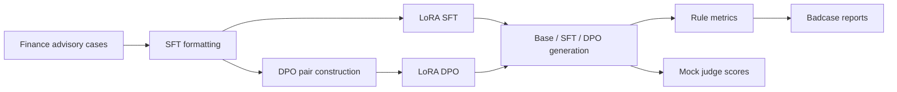

# FinPref-Align

Finance-domain preference alignment for risk-aware investment-advisory LLMs.

FinPref-Align is a compact post-training project around `Qwen/Qwen2.5-3B-Instruct`. It converts finance advisory scenarios into SFT data and DPO preference pairs, trains LoRA adapters, and evaluates whether the model becomes more compliant, concise, and suitable for user risk profiles.

> This repository is for alignment research and interview/project demonstration only. It is not investment advice and should not be used as a real financial advisory system.

## Highlights

- Built an end-to-end SFT-DPO alignment pipeline for financial advisory responses.
- Generated a P0 dataset with 3,000 SFT samples, 3,000 DPO pairs, 2,000 GRPO prompts, and 300 held-out evaluation cases.
- Trained Qwen2.5-3B-Instruct LoRA SFT and DPO adapters on an A800.
- Evaluated Base / SFT / DPO with rule metrics, deterministic judge scores, and badcase reports.
- Reduced rule badcases from 36 for Base to 9 for SFT on the 300-case P0 evaluation suite.

## Why This Project

Financial advisory assistants should not simply answer with direct buy/sell instructions. A useful response needs to:

- avoid direct investment commands;
- disclose risk and uncertainty;
- adapt to the user's risk tolerance, horizon, liquidity needs, and objective;
- ask for missing information when the user profile is incomplete;
- stay helpful without becoming a blanket refusal.

FinPref-Align frames these requirements as a preference-alignment problem: first teach the answer style with SFT, then construct chosen/rejected pairs for DPO.

## Pipeline



The P0 run focuses on the reliable SFT-DPO loop. GRPO prompt generation is included for the next iteration, but GRPO training is not part of the completed P0 result.

## P0 Results

Evaluation uses 300 held-out finance advisory cases. Metrics are rule-based and should be interpreted as engineering validation signals, not production compliance guarantees.

| Model | Compliance | Risk Disclosure | Suitability | Avg Response Length |
|---|---:|---:|---:|---:|
| Base | 97.0 | 100.0 | 91.0 | 656.66 |
| SFT | 100.0 | 100.0 | 97.0 | 156.58 |
| DPO | 100.0 | 100.0 | 94.0 | 156.78 |

Badcase summary:

| Model | Any Badcase | Compliance Failures | Suitability Failures |
|---|---:|---:|---:|
| Base | 36 | 9 | 27 |
| SFT | 9 | 0 | 9 |
| DPO | 18 | 0 | 18 |

Main takeaway: SFT is the strongest checkpoint in this P0 run. DPO preserves compliance and brevity, but its suitability score is lower than SFT, which points to a clear next step: inspect SFT-pass / DPO-fail examples and tune preference-pair construction or DPO beta.

## Data

| Split | Count | File |
|---|---:|---|
| Seed cases | 100 | `data/interim/seed_cases.jsonl` |
| SFT train | 3,000 | `data/processed/sft_train.jsonl` |
| DPO pairs | 3,000 | `data/processed/dpo_train.jsonl` |
| GRPO prompts | 2,000 | `data/processed/grpo_train.jsonl` |
| Eval cases | 300 | `data/processed/eval_finpref.jsonl` |

Validation status:

```text
SFT/DPO/GRPO validation: failed=0
Unit tests: 11 passed
```

## Training Setup

Base model:

```text
Qwen/Qwen2.5-3B-Instruct
```

SFT setup:

- LoRA `r=16`, `alpha=32`, `dropout=0.05`
- target modules: `q_proj`, `k_proj`, `v_proj`, `o_proj`, `gate_proj`, `up_proj`, `down_proj`
- bf16, gradient checkpointing
- max sequence length 2048
- 2 epochs, batch size 2, gradient accumulation 8
- learning rate `2e-5`

DPO setup:

- initialized from the SFT adapter
- LoRA, bf16, gradient checkpointing
- max prompt length 1024, max length 2048
- 1 epoch, batch size 1, gradient accumulation 16
- learning rate `5e-7`
- `beta=0.1`, sigmoid loss

## Quick Start

Install the project:

```bash
pip install -e ".[dev]"
```

Run local data generation and validation:

```bash
python scripts/00_build_seed_data.py --num_cases 100 --output data/interim/seed_cases.jsonl
python scripts/01_generate_sft_data.py --seed_file data/interim/seed_cases.jsonl --num_samples 3000 --output data/processed/sft_train.jsonl
python scripts/02_generate_preference_pairs.py --sft_file data/processed/sft_train.jsonl --num_pairs 3000 --output data/processed/dpo_train.jsonl
python scripts/03_generate_grpo_prompts.py --seed_file data/interim/seed_cases.jsonl --num_prompts 2000 --output data/processed/grpo_train.jsonl
python scripts/04_build_eval_data.py --seed_file data/interim/seed_cases.jsonl --num_cases 300 --output data/processed/eval_finpref.jsonl
python scripts/04_validate_data.py
pytest -q
```

Run training on a GPU machine:

```bash
bash scripts/05_train_sft.sh
bash scripts/06_train_dpo.sh
bash scripts/12_eval_p0_models.sh
```

For a quick evaluation smoke test:

```bash
EVAL_LIMIT=50 bash scripts/12_eval_p0_models.sh
```

## Repository Layout

```text
configs/                 Training and evaluation configs
data/processed/          P0 SFT, DPO, GRPO, and eval data
outputs/eval/            Base/SFT/DPO generated outputs and metrics
reports/                 Final report, resume bullets, and badcase analysis
scripts/                 Data, training, validation, and evaluation entrypoints
src/finpref/data/        Data builders and formatters
src/finpref/eval/        Generation, rule evaluation, judge, comparison, badcases
src/finpref/rewards/     Reward and rule helpers
src/finpref/train/       LoRA SFT/DPO training code
tests/                   Unit tests for schema, rewards, rules, and formatters
```

## Reports

- Full experiment report: `reports/final_report.md`
- Resume-ready project bullets: `reports/resume_bullets.md`
- Badcase summary: `reports/badcases/summary.md`
- Per-model badcases:
  - `reports/badcases/base/badcases.md`
  - `reports/badcases/sft/badcases.md`
  - `reports/badcases/dpo/badcases.md`

## Limitations

- The P0 data is synthetic/template-driven and is best viewed as an engineering validation set.
- The judge files are produced by a deterministic mock judge based on rule metrics, not a real external LLM judge.
- The DPO run does not outperform SFT on suitability in this version.
- GRPO data is generated, but GRPO training is left for a future iteration.
- Model adapters are not included in this repository; the repo focuses on code, data, metrics, and reports.

## Next Steps

- Analyze SFT-pass / DPO-fail examples.
- Improve preference-pair construction for fine-grained suitability.
- Run a small DPO beta sweep.
- Add real LLM-as-a-Judge or human review for a stratified subset.
- Extend the pipeline to GRPO after SFT-DPO behavior stabilizes.
